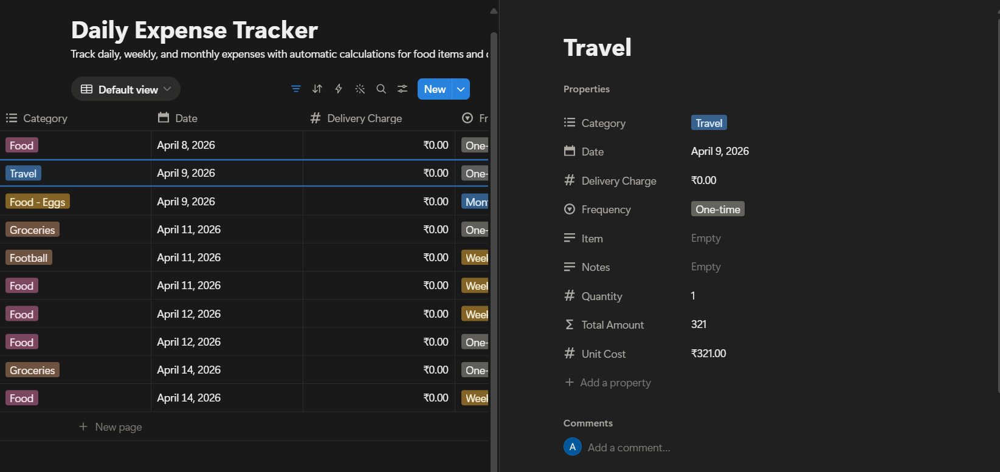
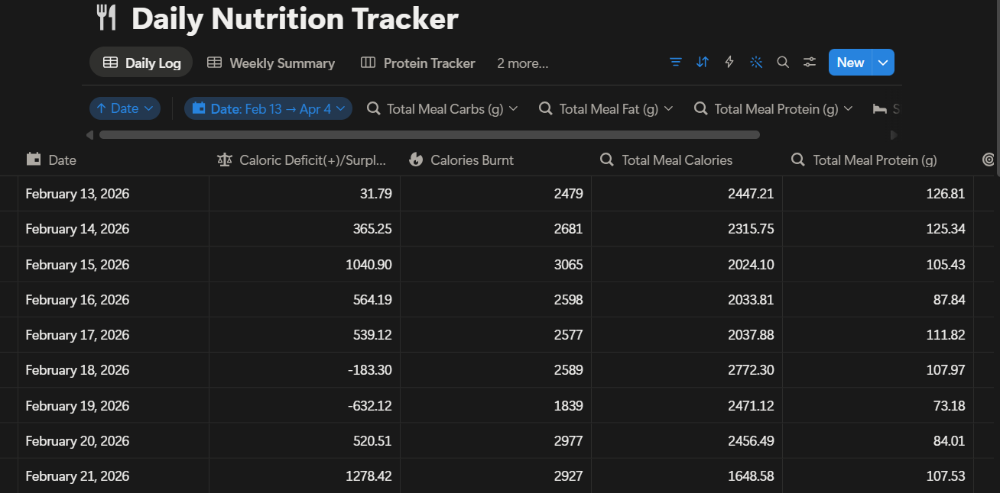
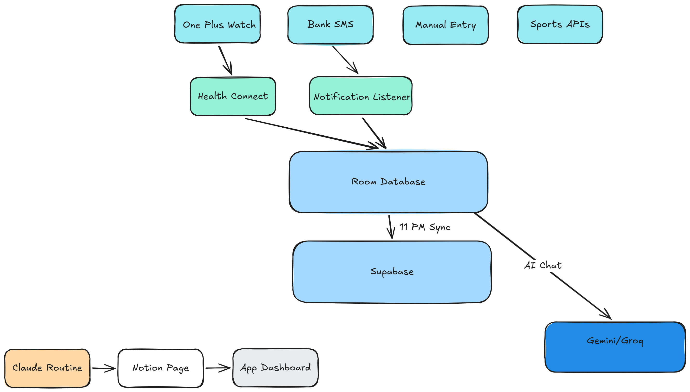
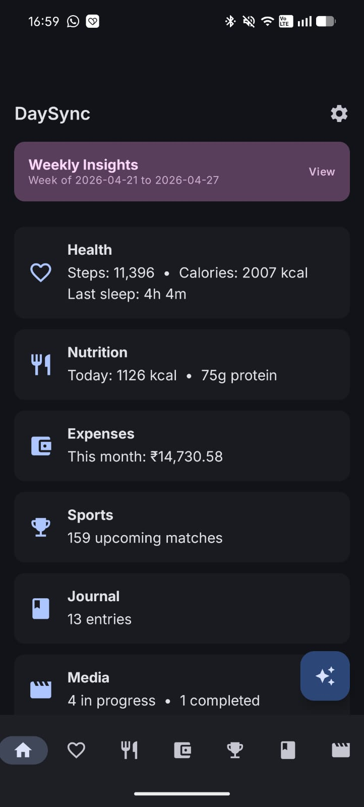
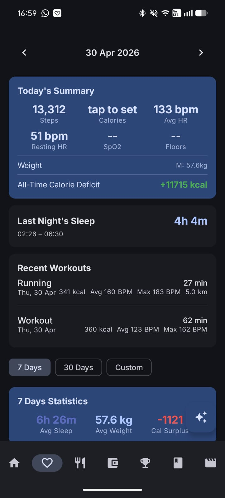
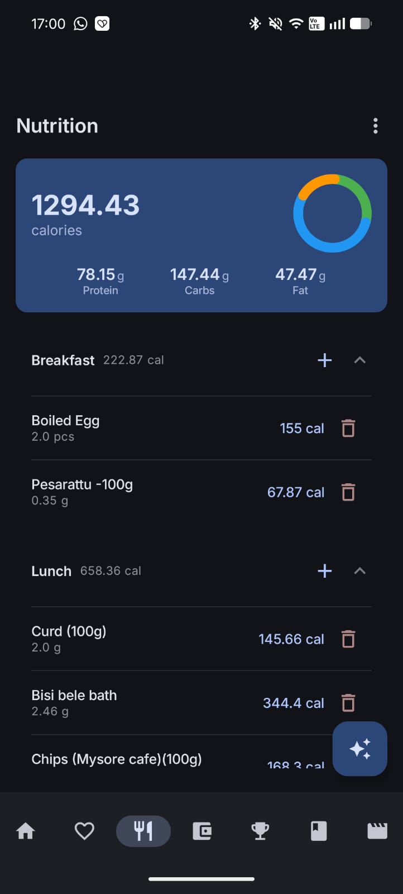
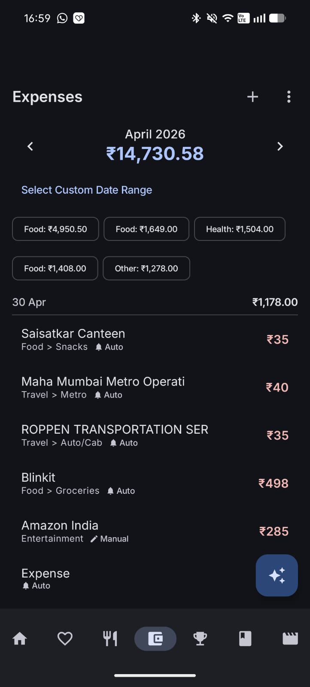
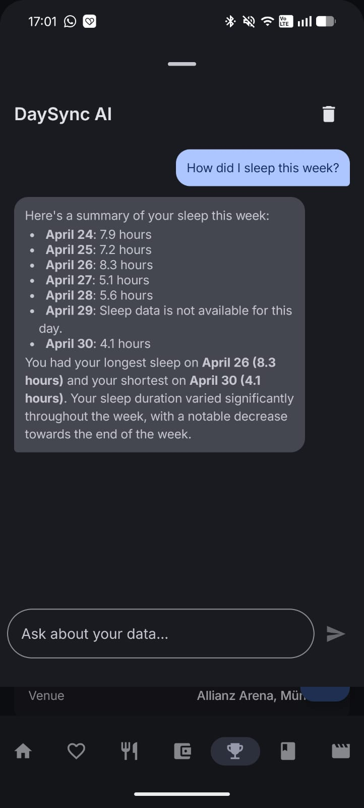

# From Notion Spreadsheets to a Native Android App: How I Automated My Daily Workflow with Vibe Coding

 Although I work in tech, I had never built anything close to an Android app or written a line of Kotlin before this project. What I did have was a problem: my daily life tracking system was falling apart under its own weight.

## The Problem: Eight Databases, One Sunday Ritual

For over a year, I tracked everything in Notion. Meals, workouts, expenses, journal entries, books and movies, weekly summaries. What started as one database, slowly  grew into eight, each with its own guide document and template.

My Weekly Summary Guide had step-by-step instructions like: "Go to Daily Expense Tracker. Filter by this week's dates. Add up all Food categories: Eggs, Bread, Protein, Oats, Paneer, Milk, Dry Fruits. Enter total here." I was doing this for six expense categories, every Sunday, by hand. Although these tasks sound easy (and are to be honest), they can feel annoying to maintain and overwhelming when they pile up.

My Workout Tracker was a massive table where I manually copied heart rate zones, cadence, calories, and split times from my OnePlus Watch after every run. A single 5K entry had twelve columns of data that I would read off my watch screen and type into Notion.

The meal library alone had 250+ items with per-unit calories, protein, carbs, and fat. Every meal entry meant opening the library, finding the food, multiplying by the amount, and logging it in a separate daily tracker.

*My Notion expense tracker — every transaction logged by hand, categories summed manually every Sunday.*

*250+ food items in one database, daily entries in another. Every meal meant cross-referencing between the two.*

It worked. But it took 30-40 minutes every Sunday just for the weekly summary, plus daily logging overhead that I increasingly skipped when I was busy. The data was only as good as my discipline to enter it. As they say time is money, and more than often you feel poor. When you're trying to keep up with daily tasks, manually logging all your minor details feel more like a chore than a priority.

## The Approach: Vibe Coding as a Collaborative Workflow

I started building DaySync in February 2026 using Claude Code as my primary development tool. The term "vibe coding" gets thrown around a lot, but hopefully this article can explain how the experience was for me and what I learned during the course of the project.

I described what I wanted in natural language. Claude wrote the Kotlin. I tested on my phone, reported what broke, and we iterated. I did not hand-write the Room entity definitions or the Ktor API clients. But I did take the time to learn the architecture and make architectural decisions: offline-first with Room, Supabase for cloud sync, Health Connect for watch data, notification listener for expense capture.

The learning curve was real. I had to understand enough about Jetpack Compose to know why a LazyColumn was crashing, enough about Room migrations to know that destructive fallback would wipe user data, enough about Android's foreground service restrictions on SDK 36 to debug why the app was crashing in the background. Claude could write the code, but I had to understand the system well enough to direct it and catch when something was wrong.

In the modern era of coding, "I don't know the language" is no longer a valid excuse. An agent is ready to do the manual work for you. However, the quality of output depends on the effort you put in to understanding the design and guiding the agent. I have no doubt a kotlin expert could guide claude to create a better app than I did, however I know I did much better than most beginners could and I'm very proud of the results.

Over 11 weeks and 178 commits, the codebase grew to around 30,000 lines of Kotlin across 272 files. The app has 24 database tables locally, syncs to 16 Supabase tables, and integrates with 10+ external APIs. All running on free tiers. Total monthly cost: zero.

## What I Built

*How data flows through DaySync: four input sources feed into Room (local), sync to Supabase (cloud), with AI analysis via Claude and Gemini.*

DaySync consolidates seven tracking areas into a single Android app. Here is what changed for each:

*The DaySync dashboard. Weekly Insights card at the top (generated by Claude), section summaries below, AI FAB in the corner.*

**Health and Fitness.** Before: I copied watch data into Notion tables by hand. After: Health Connect pulls steps, heart rate, sleep stages, SpO2, workouts, and VO2 max directly from my watch. I just open the app and the data is there, with trend charts I can filter by 7 days, 30 days, or any custom date range. I manually log my weight (morning, evening, night) and calories burned. The app computes my daily and all-time calorie deficit automatically.

*Today's health summary — 13,312 steps, last night's sleep, recent workouts with HR data, and 7-day statistics at the bottom. All pulled automatically from the watch via Health Connect.*

**Nutrition.** Before: 250-item meal library in Notion, daily entries in a separate database. After: The entire library imported into the app with one tap. I add meals to breakfast, lunch, dinner, or snacks by searching the library. Nutrition labels can be scanned with the camera. Gemini extracts the data; if that fails, it falls back to on-device OCR plus Groq for parsing. Daily and historical summaries with macro breakdowns.

*Daily nutrition tracking with individual food items per meal and a macro breakdown. The same 250+ item library, now searchable in the app.*

**Expenses.** Before: I logged every transaction manually in a daily expense tracker, then summed categories weekly. After: The app reads bank SMS notifications in real time, parses the amount and merchant, and categorizes them using saved rules. I set a rule once (the merchant goes in this category), and every future transaction from that merchant is auto-categorized. Monthly totals, category breakdowns, and custom date range filtering are all automatic.

*Auto-captured expenses — notice the "Auto" badges. The app parsed these from bank SMS notifications and applied payee rules to categorize them automatically.*

**Sports.** Before: I checked scores manually. After: Live scores, upcoming fixtures, and results across football, NBA, F1, tennis, and MMA. I follow competitions, watchlist specific matches, and add personal notes (Watchnotes) to any match. Data comes from Football-Data.org, API-Football, ESPN, BallDontLie, and Jolpica.

**Journal.** Before: Notion database with mood and tags. After: Same concept, but integrated with everything else. Entries sync to Supabase and can be exported back to Notion.

**Media.** Before: A "Books/Movies etc" Notion database. After: Track books, movies, TV, anime, manga, games, and music with metadata search powered by OMDB, Google Books, Jikan, Steam, MusicBrainz, and OpenLibrary. Ratings, status tracking, completion dates.

**AI Assistant.** A floating chat button that can answer questions about any of my data. "What was my calorie deficit this week?" or "Compare my sleep on workout days vs rest days." It has full context of my health metrics, meals (individual items, not just summaries), weight, expenses, journal, sports, and media. Powered by Gemini 2.5 Flash with Groq as fallback.

*The AI assistant answering "How did I sleep this week?" — it has access to the full week's sleep data from Health Connect and responds with a per-day breakdown.*

All the data that I was interested in tracking to help me keep my goals in check was now automated and a click away on my phone.

## The Integration Layer

Everything syncs to Supabase at a configurable time (default 11 PM). A Claude routine runs weekly, queries my Supabase data directly through the official connector, generates a summary with recommendations, and writes it to a Notion page. The app picks up that summary and displays it as a "Weekly Insights" card on the dashboard.

This closes the loop: the app replaced Notion for daily data capture, but Notion still serves as the destination for AI-generated analysis. The manual Sunday summary ritual is now fully automated.

If the app is reinstalled or the local database is wiped, a "Restore from Cloud" button in Settings downloads all user-entered data from Supabase. Health metrics and sports data regenerate from their respective APIs automatically.

## Technical Decisions That Mattered

**Offline-first.** Room stores everything locally. Supabase sync is a background job. The app works without internet, which really matters logging meals or checking workout history without signal. The relief of having an app that works without wifi in the modern age of technology is quite refreshing.

**Free-tier everything.** Gemini, Groq, Supabase, Football-Data.org, API-Football, BallDontLie, Jolpica, OMDB, MusicBrainz, Google Books. Ten-plus APIs, all free. The only potential cost is Claude API if you want in-app Claude chat ($0.30/month for light use), but the default Gemini setup costs nothing.

**Configurable for any user.** Timezone, currency, sync time, and reminder time are all adjustable in Settings. The Notion integration is optional (added because it was relevant to my use case): buttons are hidden if no API key is configured. API keys live in a gitignored local.properties file, so anyone can clone the repo, add their own keys, and build.

**AI fallback chains.** The nutrition scanner tries Gemini first. If that times out (common on free tier), it falls back to ML Kit OCR (offline, on-device) feeding the extracted text to Groq for structured parsing. The AI chat tries Gemini first, falls back to Groq. Nothing silently fails.

## What I Learned

The biggest insight was that vibe coding is not "AI writes code, I ship it." It is more like pair programming where your partner types faster than you but occasionally introduces bugs that require understanding the underlying framework to catch.

I don't want to get things twisted. Vibe coding is not the same as "learning the language". I can say I worked on a project involving Kotlin and Android apps, not that I know how to code in the language. For fresh developers, learning the language and hands on work is always the best way to gain in depth knowledge in a field.  However, as a learning developer, I also gain a wealth of experience by increasing my breadth of knowledge in varied fields and shipping projects from start to end in barely a quarter of the time.

SDK 36 foreground service restrictions caused days of debugging. Health Connect's sleep session timestamps needed careful handling (a session that starts Wednesday night and ends Thursday morning belongs to Thursday, not Wednesday). Vico chart library crashed on empty datasets. None of these were problems Claude could solve from a prompt alone. They required reading crash logs, understanding Android lifecycle, and testing on real hardware.

Though this seems obvious for Devs familiar with agentic based coding, the CLAUDE.md file became essential. It is a document at the root of the repo that captures architectural decisions and operational context. Every time I started a new session, Claude read it and had the full project context. This is the single most practical technique I would recommend to anyone doing AI-assisted development.

Another is to always encourage deep research and back and forth discussions before finalising and implementation plan (and even during implementation if you have doubts). Questioning the AI not only helps you learn more, but it also builds context, facilitating a two way learning. The time consumed by execution, can now be spent in planning and understanding, allowing to ship a better product in less time.

## What This Does Not Do (Yet)

This is a personal project that works well for my specific setup. Some limitations worth noting:

- **Expense parsing supports HDFC Bank only.** Adding more Indian banks is straightforward (same SMS format conventions), but international banks would need entirely different parsers.
- **Currency defaults to INR.** The display formatting is configurable, but the bank SMS parsing is India-specific.
- **No cricket support.** (Sorry Fellow Indians!) Football, NBA, F1, tennis, and MMA are covered. Cricket would need a new API integration.
- **AI uses context-dump, not RAG.** The assistant works well for "last week" or "this month" queries because the data fits in a single prompt. Multi-year historical analysis would need embeddings, which are planned but not implemented.

The project is open source. If any of these limitations affect you, the codebase is structured to make extensions straightforward.

## Try It Yourself

The project is on GitHub: [github.com/Arjun-Avadhanam/DaySync](https://github.com/Arjun-Avadhanam/DaySync)

To set it up:

1. Clone the repo
2. Add your API keys to `local.properties` (all optional, features degrade gracefully)
3. Apply the Supabase migrations in `supabase/migrations/`
4. Build with `./gradlew assembleDebug`

Full setup instructions and the key list are in the README. The app runs on Android 9+ (API 28) and targets Android 16 (SDK 36).

---

*DaySync replaced eight Notion databases, eliminated my manual Sunday summary, and gave me automated health tracking, expense capture, and AI-powered analysis. It cost nothing to run and took 11 weeks to build. The code is open source if you want to adapt it for your own workflow.*
